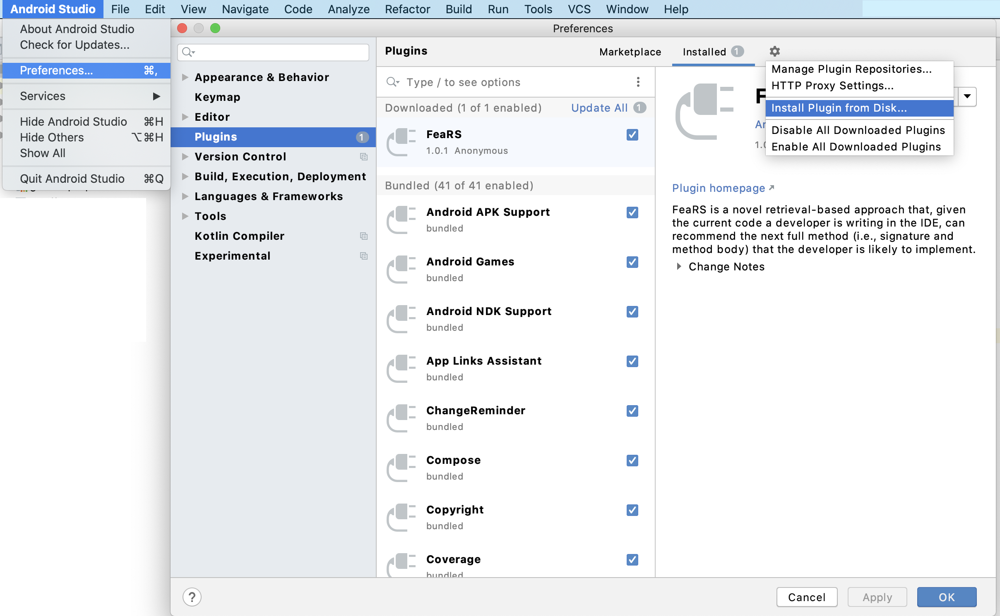
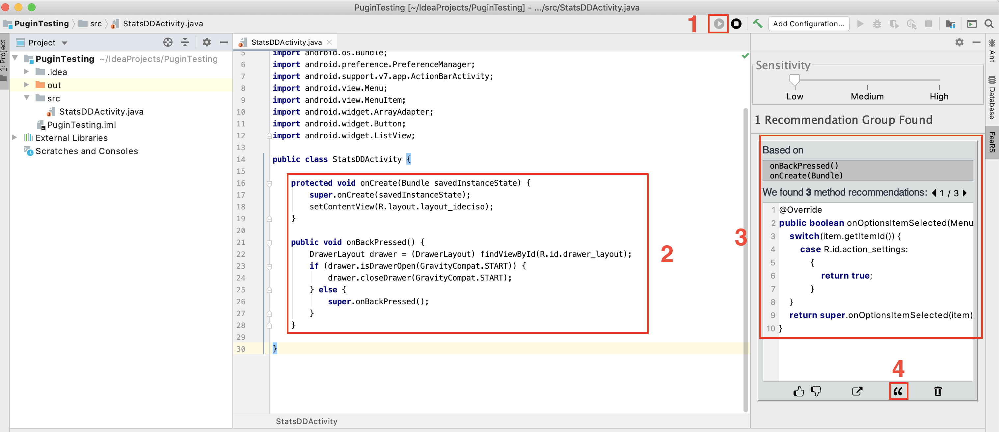

# FeaRS Plugin

### Supported IDE
The plugin can be installed on *Android Studio* and *IntelliJ IDEA* IDEs.

### How to Install the plugin

To install the plugin on one of supported IDEs, go to `Preference > Plugin > Gear Icon > Install plugin from Disk` and select the `FeaRS.zip` file (without manually unzipping it).

### How to use the plugin

1. After the plugin is installed, press on the  icon to start monitoring the method changes.
2. Implement a set of new methods in the IDE.
3. After the newly added methods are identified, the recommendations will be presented in the plugin window.
4. If the recommendation is applicable, press on the  icon to copy the code snippet recommended.
